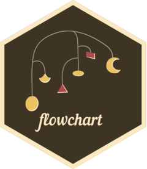

# flowchart <a href="https://bruigtp.github.io/flowchart/"></a>

[](https://cran.r-project.org/package=flowchart) &#160;&#160; [](https://github.com/bruigtp/flowchart/actions/workflows/R-CMD-check.yaml) &#160;&#160; [](https://cran.r-project.org/package=flowchart) &#160;&#160; [](https://cran.r-project.org/package=flowchart)

## Tidy Flowchart Generator

`flowchart` is an R package for drawing participant flow diagrams directly from a dataframe using tidyverse. It provides a set of functions that can be combined with a pipe operator to create all kinds of flowcharts from a dataframe in an easy way.

You can see the package in action in: https://bruigtp.github.io/flowchart/

## How to install it?

The package is available on CRAN: https://cran.r-project.org/web/packages/flowchart/index.html.
``` r
install.packages("flowchart")
```
We can download the development version from the github repository:
``` r
# install.packages("remotes")
remotes::install_github('bruigtp/flowchart')
```

## How it works?

The following GIF provides an example of the tidy process of drawing a flowchart for a clinical trial:


## About

Package: flowchart

Type: Package

Version: 0.5.1 (CRAN)

Authors: Pau Satorra, João Carmezim, Natàlia Pallarès, Cristian Tebé.

Maintainer: Pau Satorra

License: GPL (>= 3)

Encoding: UTF-8

Depends: R (>= 4.1.0)
