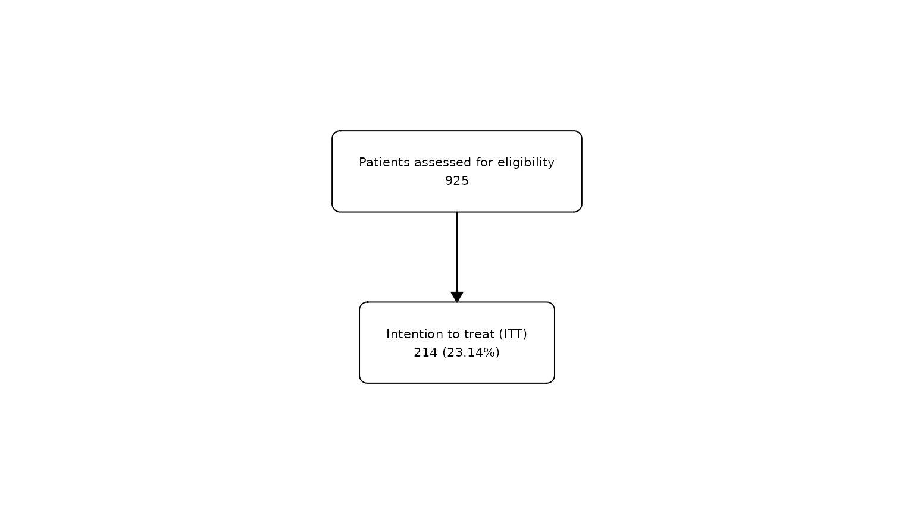
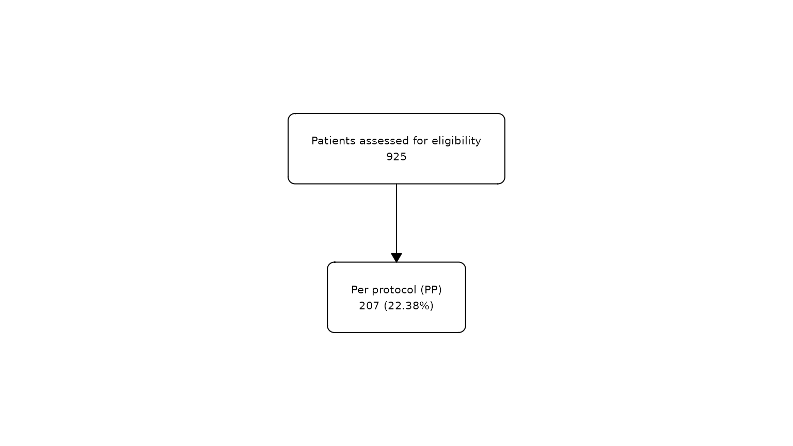
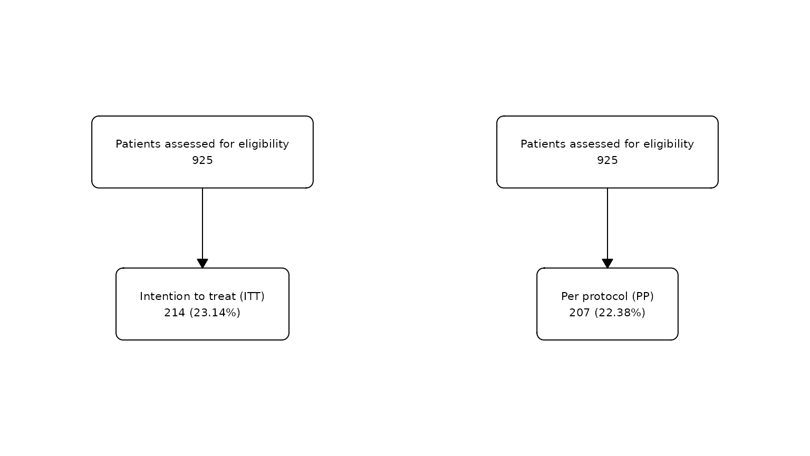
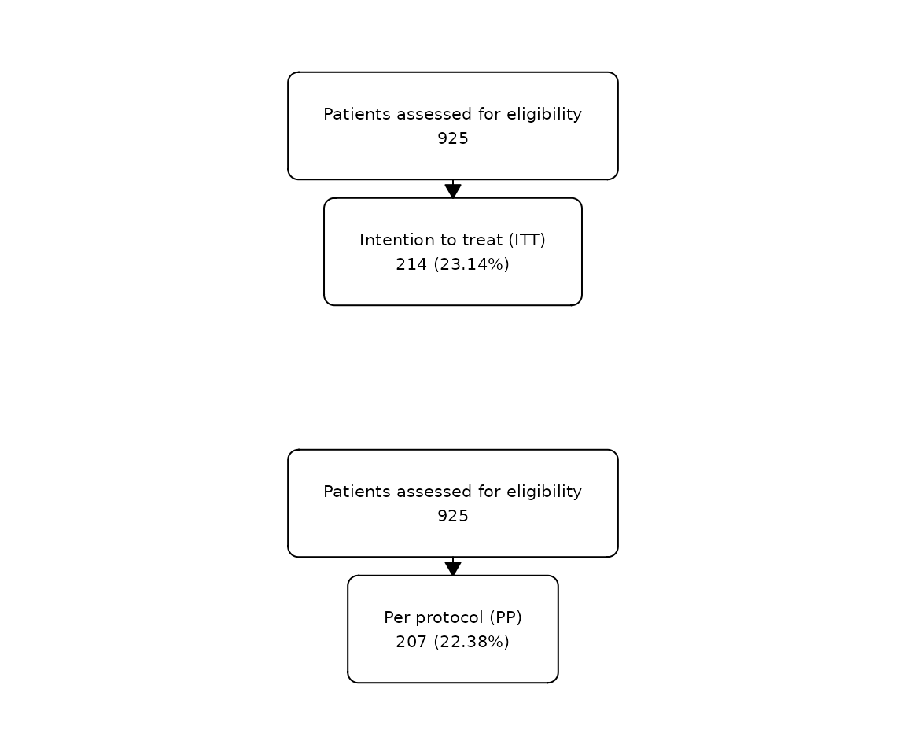
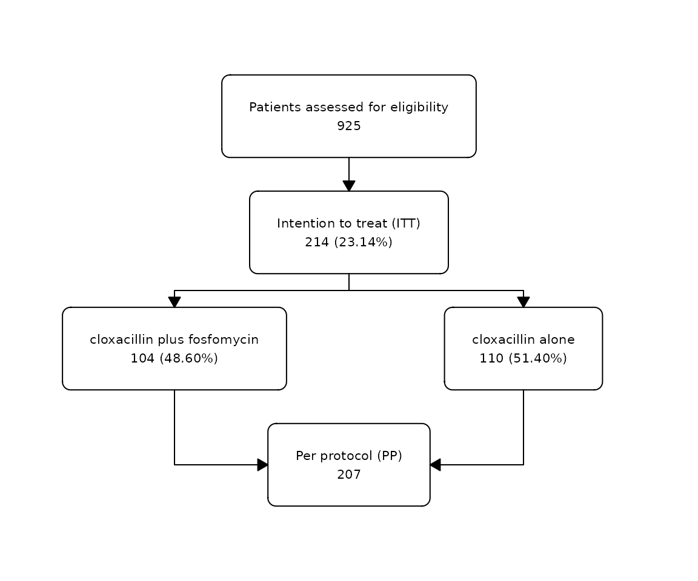
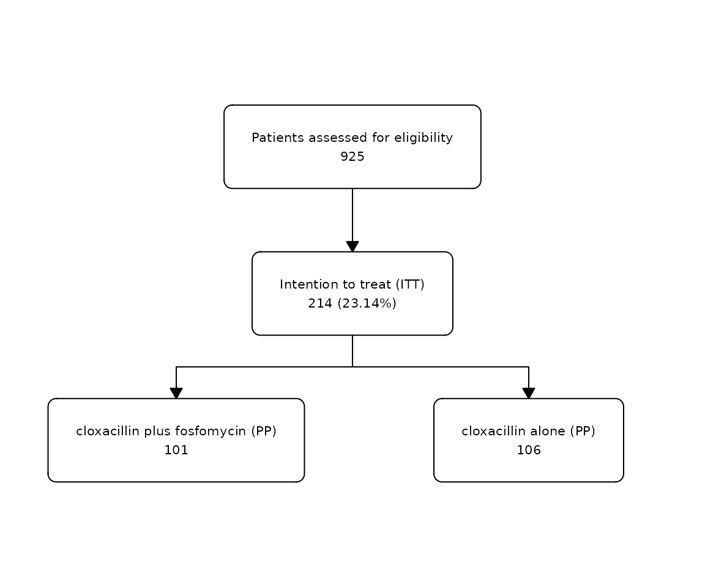
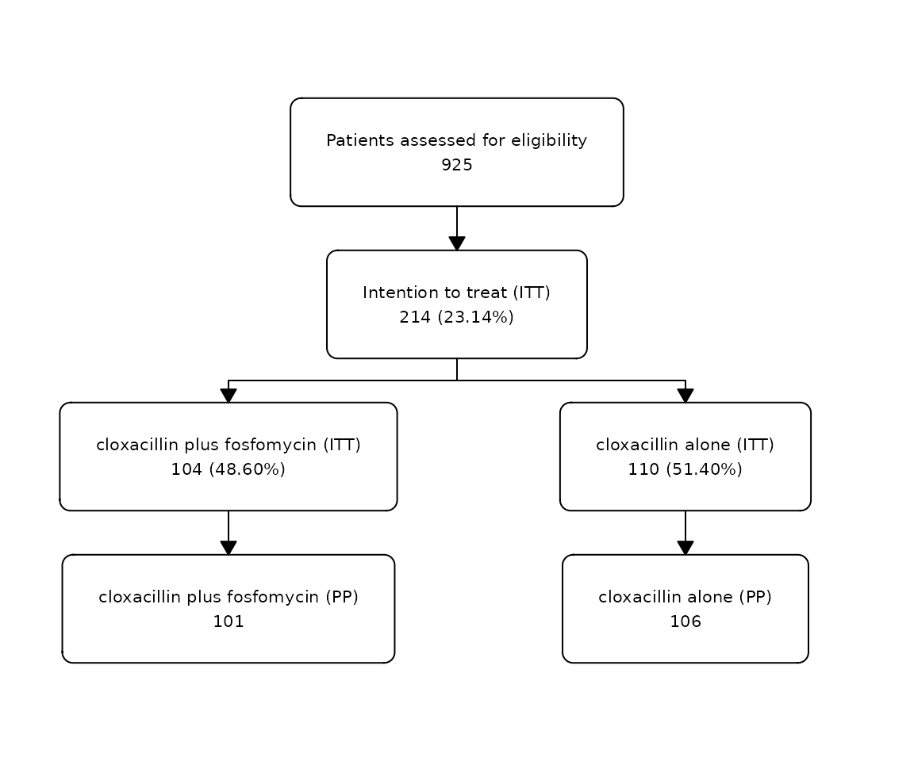

# Combine Flowcharts

[`fc_merge()`](https://bruigtp.github.io/flowchart/reference/fc_merge.md)
and
[`fc_stack()`](https://bruigtp.github.io/flowchart/reference/fc_stack.md)
allow you to combine different flowcharts horizontally or vertically.
This is very useful when you need to combine flowcharts generated from
different `data.frame`s, as shown here.

## Merge

We can combine different flowcharts horizontally using
[`fc_merge()`](https://bruigtp.github.io/flowchart/reference/fc_merge.md).
For example, we might want to represent the flow of patients included in
the ITT population with the flow of patients included in the PP
population.

``` r

# Create first flowchart for ITT
fc1 <- safo |> 
  as_fc(label = "Patients assessed for eligibility") |>
  fc_filter(itt == "Yes", label = "Intention to treat (ITT)")

fc_draw(fc1)
```



``` r

# Create second flowchart for visits
fc2 <- safo |> 
  as_fc(label = "Patients assessed for eligibility") |>
  fc_filter(pp == "Yes", label = "Per protocol (PP)")

fc_draw(fc2)
```



``` r

list(fc1, fc2) |> 
  fc_merge() |> 
  fc_draw()
```



## Stack

We can combine different flowcharts vertically using
[`fc_stack()`](https://bruigtp.github.io/flowchart/reference/fc_stack.md).
For example, we can combine the same two flowcharts vertically instead
of horizontally.

``` r

list(fc1, fc2) |> 
  fc_stack() |> 
  fc_draw()
```



We can use the argument `unite = TRUE` to connect two stacked
flowcharts. Two flowcharts can be merged only if they have the same
boxes at the beginning and at the end, or if one of the flowcharts has
one box at the beginning or at the end. For example:

``` r

fc1 <- safo |> 
  as_fc(label = "Patients assessed for eligibility") |>
  fc_filter(itt == "Yes", label = "Intention to treat (ITT)")  |> 
  fc_split(group)

fc2 <-  safo |> 
  dplyr::filter(pp == "Yes") |> 
  as_fc(label = "Per protocol (PP)")

list(fc1, fc2) |> 
  fc_stack(unite = TRUE) |> 
  fc_draw()
```



``` r

fc1 <- safo |> 
  as_fc(label = "Patients assessed for eligibility") |>
  fc_filter(itt == "Yes", label = "Intention to treat (ITT)") 

fc2 <-  safo |> 
  dplyr::filter(pp == "Yes") |> 
  as_fc(hide = TRUE) |> 
  fc_split(group, label = c("cloxacillin plus fosfomycin (PP)", "cloxacillin alone (PP)"), text_pattern = "{label}\n{n}") 

list(fc1, fc2) |> 
  fc_stack(unite = TRUE) |> 
  fc_draw()
```



``` r

fc1 <- safo |> 
  as_fc(label = "Patients assessed for eligibility") |>
  fc_filter(itt == "Yes", label = "Intention to treat (ITT)") |> 
  fc_split(group, label = c("cloxacillin plus fosfomycin (ITT)", "cloxacillin alone (ITT)"))

fc2 <-  safo |> 
  dplyr::filter(pp == "Yes") |> 
  as_fc(hide = TRUE) |> 
  fc_split(group, label = c("cloxacillin plus fosfomycin (PP)", "cloxacillin alone (PP)"), text_pattern = "{label}\n{n}") 

list(fc1, fc2) |> 
  fc_stack(unite = TRUE) |> 
  fc_draw()
```


