# Flowchart Customization

We can customize the flowchart either with the arguments provided by
each function in the process of creating it, or directly in the final
output using the
[`fc_theme()`](https://bruigtp.github.io/flowchart/reference/fc_theme.md)
or
[`fc_modify()`](https://bruigtp.github.io/flowchart/reference/fc_modify.md)
functions.

## Change function arguments

There are many different arguments in
[`as_fc()`](https://bruigtp.github.io/flowchart/reference/as_fc.md),
[`fc_filter()`](https://bruigtp.github.io/flowchart/reference/fc_filter.md),
[`fc_split()`](https://bruigtp.github.io/flowchart/reference/fc_split.md),
and
[`fc_draw()`](https://bruigtp.github.io/flowchart/reference/fc_draw.md)
that allow you to customize the boxes created at each step. See the
documentation for these functions for more information. Some examples of
how to use these arguments are given at the end of the vignette:
[Customization examples](#customization-examples).

## Functions to customize the flowchart

### `fc_theme()`

We can use
[`fc_theme()`](https://bruigtp.github.io/flowchart/reference/fc_theme.md)
to set all parameters for all boxes in a flowchart at once. This is
useful if we want to apply the same style to all the boxes. For example,
let’s customize the following flowchart:

``` r

safo |> 
  dplyr::filter(!is.na(group)) |> 
  as_fc(label = "Randomized patients") |>
  fc_split(group) |> 
  fc_draw()
```

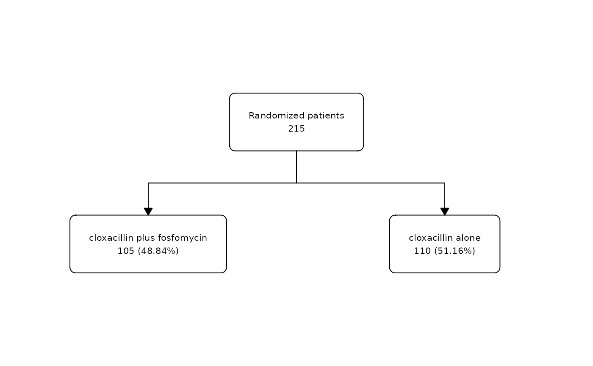

Let’s change the style of all the boxes:

``` r

safo |> 
  dplyr::filter(!is.na(group)) |> 
  as_fc(label = "Randomized patients") |>
  fc_split(group) |>
  fc_theme(text_pattern_init = "{label}, {n}", text_pattern = "{label}, {n}/{N}", text_fs = 11, text_color = "#324C54", text_fface = 2, bg_fill = "#ADD8E6") |> 
  fc_draw()
```

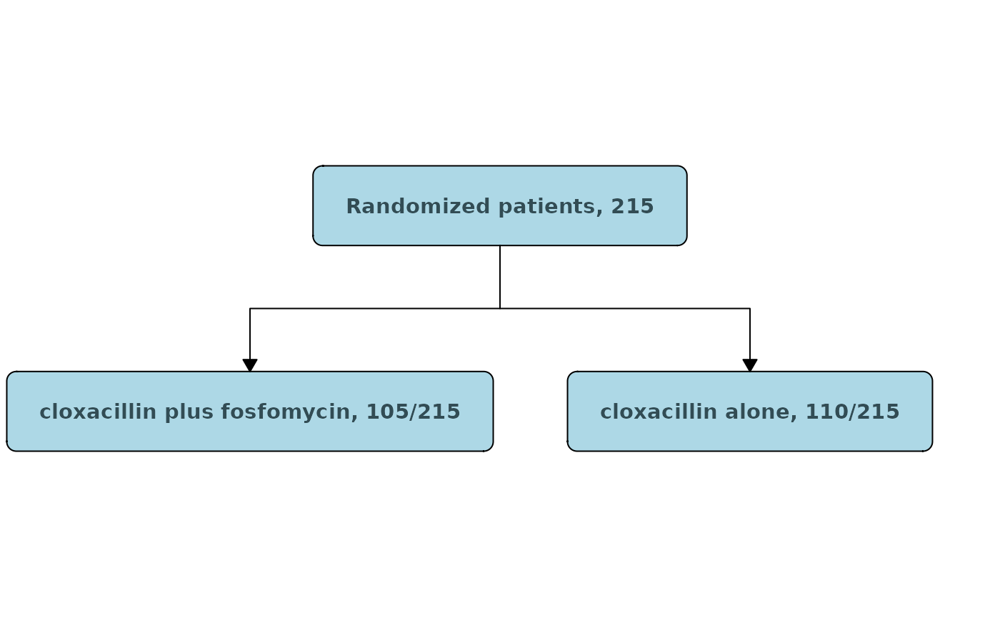

### `fc_modify()`

The function `fc_modify` allows the user to customise the created
flowchart by modifying its parameters, which are stored in `.$fc`.

For example, let’s customize the following flowchart:

``` r

safo_fc <- safo |> 
  as_fc(label = "Patients assessed for eligibility") |>
  fc_filter(!is.na(group), label = "Randomized", show_exc = TRUE) 

safo_fc |> 
  fc_draw()
```

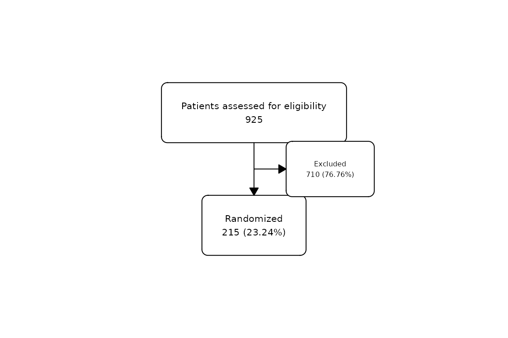

Previous to modifying it, we can use the function fc_view() to inspect
the element \$fc that we want to change:

``` r

safo_fc |> 
  fc_view("fc")
```

    ## # A tibble: 3 × 22
    ##      id     x     y     n     N perc  label text_pattern text  type  group just 
    ##   <int> <dbl> <dbl> <int> <int> <chr> <chr> <chr>        <chr> <chr> <lgl> <chr>
    ## 1     1  0.5  0.667   925   925 100   Pati… "{label}\n{… "Pat… init  NA    cent…
    ## 2     2  0.5  0.333   215   925 23.24 Rand… "{label}\n … "Ran… filt… NA    cent…
    ## 3     3  0.65 0.5     710   925 76.76 Excl… "{label}\n … "Exc… excl… NA    cent…
    ## # ℹ 10 more variables: text_color <chr>, text_fs <dbl>, text_fface <dbl>,
    ## #   text_ffamily <lgl>, text_padding <dbl>, bg_fill <chr>, border_color <chr>,
    ## #   width <lgl>, height <lgl>, end <lgl>

Let’s customise the text in the exclusion box (id = 3) to specify
different reasons for exclusion, and change the x and y coordinate:

``` r

safo_fc |> 
  fc_modify(
    ~ . |> 
      mutate(
        text = ifelse(id == 3, str_glue("- {sum(safo$inclusion_crit == 'Yes')} not met the inclusion criteria\n- {sum(safo$exclusion_crit == 'Yes')} met the exclusion criteria"), text),
        x = case_when(
          id == 3 ~ 0.75,
          TRUE ~ x
        ),
        y = case_when(
          id == 1 ~ 0.8,
          id == 2 ~ 0.2,
          TRUE ~ y
        )
      )
  ) |> 
  fc_draw()
```

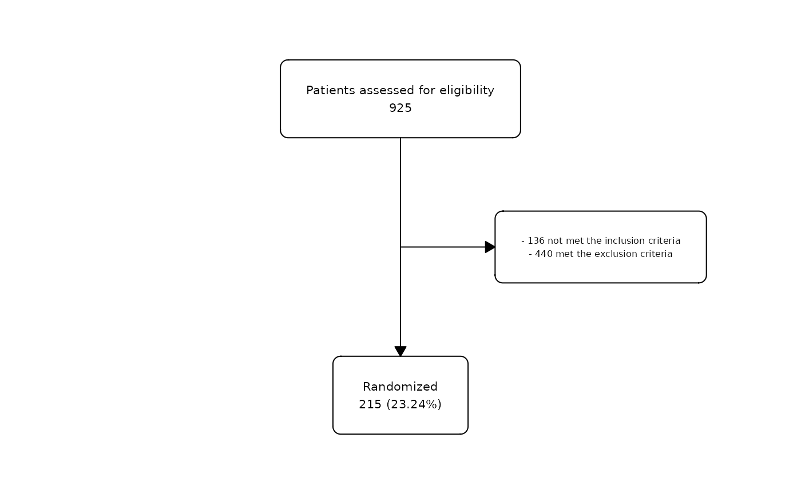

## Customization examples

In these examples, we will explore some of the arguments to customize
the following flowchart:

``` r

safo |> 
  as_fc(label = "Patients assessed for eligibility") |>
  fc_filter(!is.na(group), label = "Randomized", show_exc = TRUE) |> 
  fc_split(group) |> 
  fc_draw()
```


### Change the flowchart appearance

You can set the background color of each box using `bg_fill=`:

``` r

safo |> 
  as_fc(label = "Patients assessed for eligibility", width = 0.6, text_fs = 10, text_fface = 2, text_ffamily = "serif", text_padding = 2, bg_fill = "lightgrey") |>
  fc_filter(!is.na(group), label = "Randomized", show_exc = TRUE, text_color = "white", bg_fill = "darkgreen", text_color_exc = "white", bg_fill_exc = "firebrick") |> 
  fc_split(group, bg_fill = c("darkblue", "purple"), text_color = "white") |> 
  fc_modify(
    ~ . |> 
      mutate(
        y = case_when(
          type == "init" ~ 0.8,
          .default = y
        )
      )
  ) |> 
  fc_draw()
```

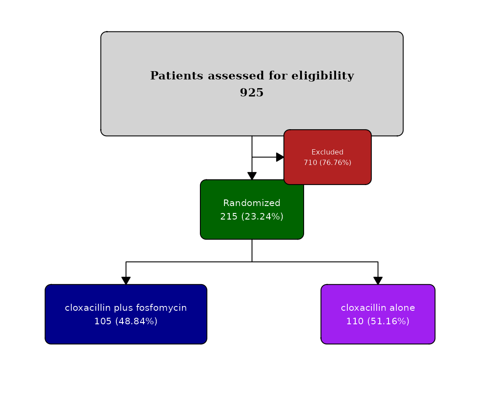

You can also alter the background of the canvas behind the flowchart
boxes using the `bg_canvas=` argument in `fc_draw`:

``` r

safo |> 
  as_fc(label = "Patients assessed for eligibility", width = 0.6, text_fs = 10, text_fface = 2, text_ffamily = "serif", text_padding = 2, bg_fill = "lightgrey") |>
  fc_filter(!is.na(group), label = "Randomized", show_exc = TRUE, text_color = "white", bg_fill = "darkgreen", text_color_exc = "white", bg_fill_exc = "firebrick") |> 
  fc_split(group, bg_fill = c("darkblue", "purple"), text_color = "white") |> 
  fc_modify(
    ~ . |> 
      mutate(
        y = case_when(
          type == "init" ~ 0.8,
          .default = y
        )
      )
  ) |> 
  fc_draw(canvas_bg = "darkgrey")
```

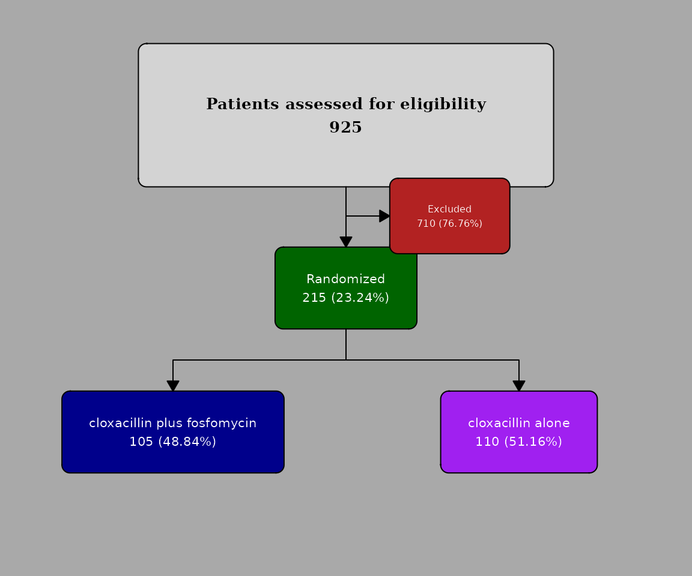

### Add a title to the flowchart

We can add a title to the flowchart using the argument `title=` in the
[`fc_draw()`](https://bruigtp.github.io/flowchart/reference/fc_draw.md)
function:

``` r

safo |> 
  as_fc(label = "Patients assessed for eligibility") |>
  fc_filter(!is.na(group), label = "Randomized", show_exc = TRUE) |> 
  fc_split(group) |> 
  fc_draw(title = "SAFO flowchart")
```

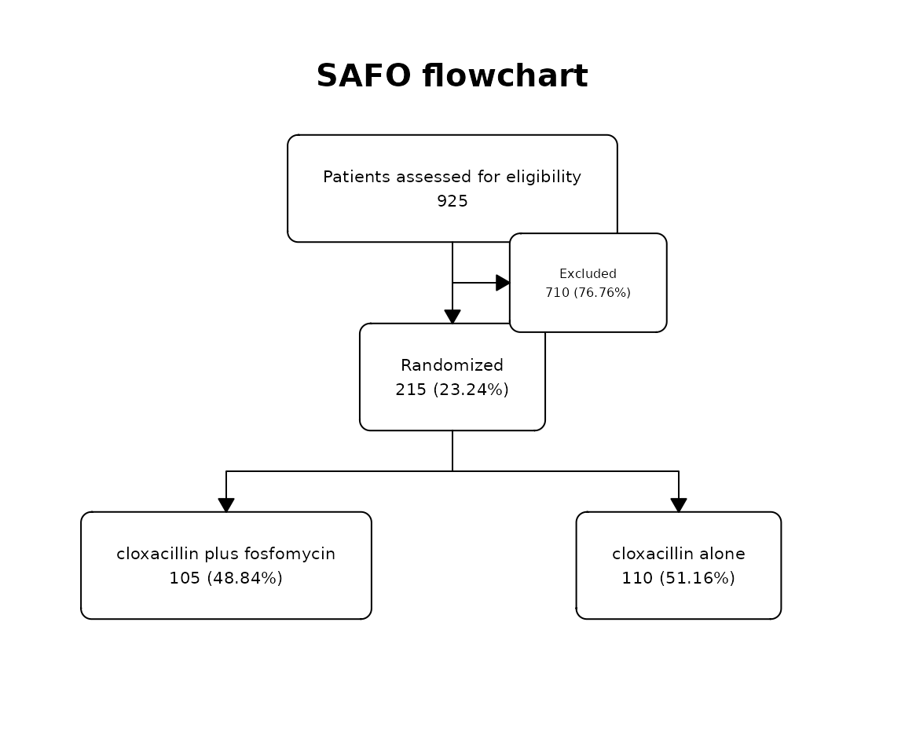

### Add titles in each step

We can also add titles to each step of a flowchart to create
[CONSORT](https://www.equator-network.org/reporting-guidelines/consort/)-style
flow diagrams. The argument `title` must be used in the
[`as_fc()`](https://bruigtp.github.io/flowchart/reference/as_fc.md),
[`fc_filter()`](https://bruigtp.github.io/flowchart/reference/fc_filter.md)
or
[`fc_split()`](https://bruigtp.github.io/flowchart/reference/fc_split.md)
functions:

``` r

as_fc(N = 100, label = "Assessed for eligibility", title = "Enrollment") |> 
  fc_filter(N = 80, label = "Randomized") |> 
  fc_split(N = c(40, 40), label = c("Allocated to control", "Allocated to intervention"), title = "Allocation") |> 
  fc_filter(N = c(31, 34), label = "Lost to follow-up", title = "Follow-up") |> 
  fc_filter(N = c(30, 32), label = "Analyzed", title = "Analysis") |> 
  fc_draw()
```

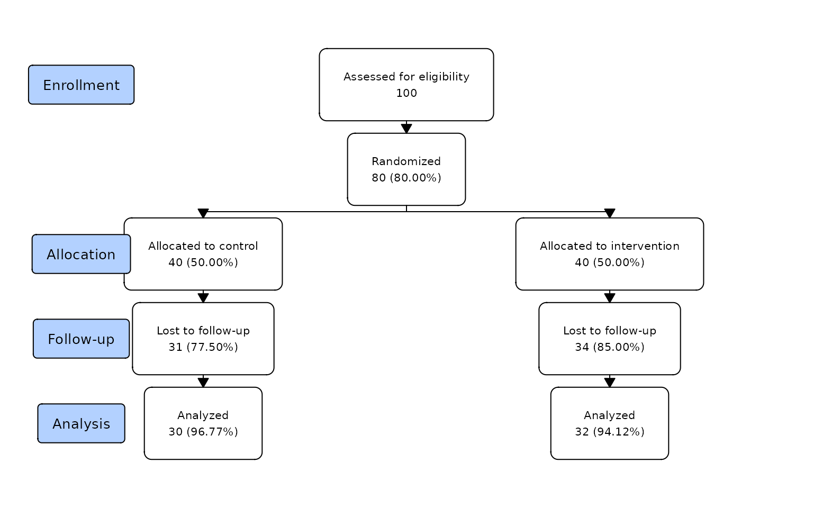

### Percentage with respect to the total rows

We can change the calculation of all percentages in a `flowchart.` By
default, percentages are calculated with respect to the box in the
previous level. With the argument `perc_total=` we can change it, to
calculate it with respect to the initial box with the total number of
rows:

``` r

safo |> 
  as_fc(label = "Patients assessed for eligibility") |>
  fc_filter(!is.na(group), label = "Randomized", show_exc = TRUE, perc_total = TRUE) |> 
  fc_split(group, perc_total = TRUE) |> 
  fc_draw()
```

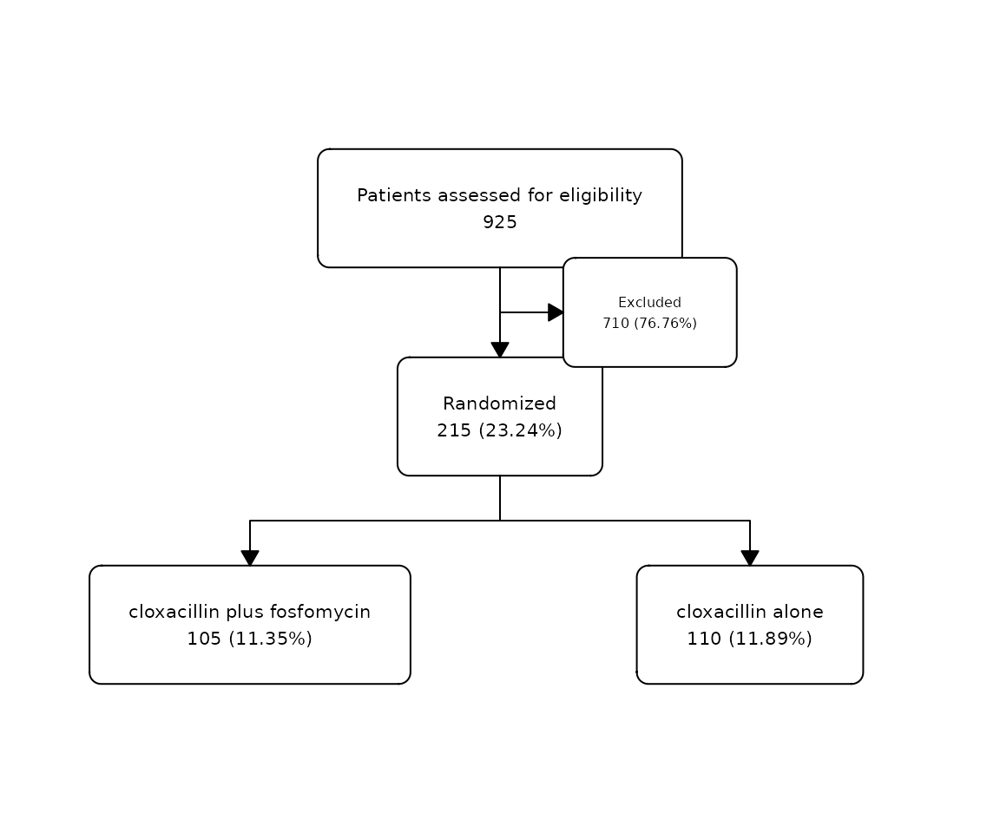

### Offset

We can add/remove space to the distance between boxes in a split using
the argument `offset`:

``` r

safo |> 
  as_fc(label = "Patients assessed for eligibility") |>
  fc_filter(!is.na(group), label = "Randomized", show_exc = TRUE, perc_total = TRUE) |> 
  fc_split(group, offset = 0.1) |> 
  fc_draw()
```

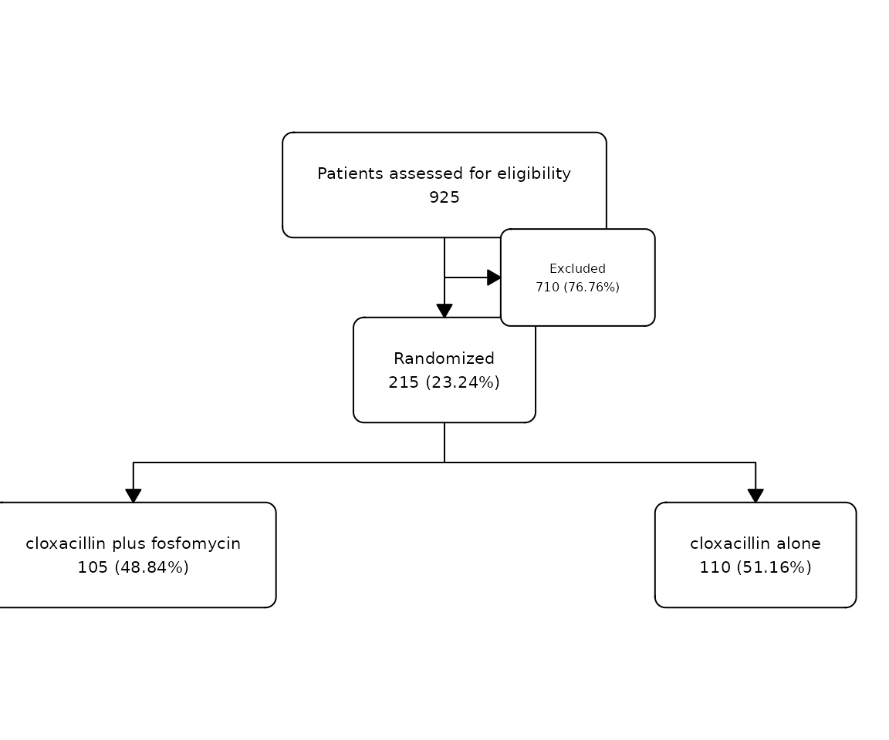

``` r

safo |> 
  as_fc(label = "Patients assessed for eligibility") |>
  fc_filter(!is.na(group), label = "Randomized", show_exc = TRUE, perc_total = TRUE) |> 
  fc_split(group, offset = -0.1) |> 
  fc_draw()
```

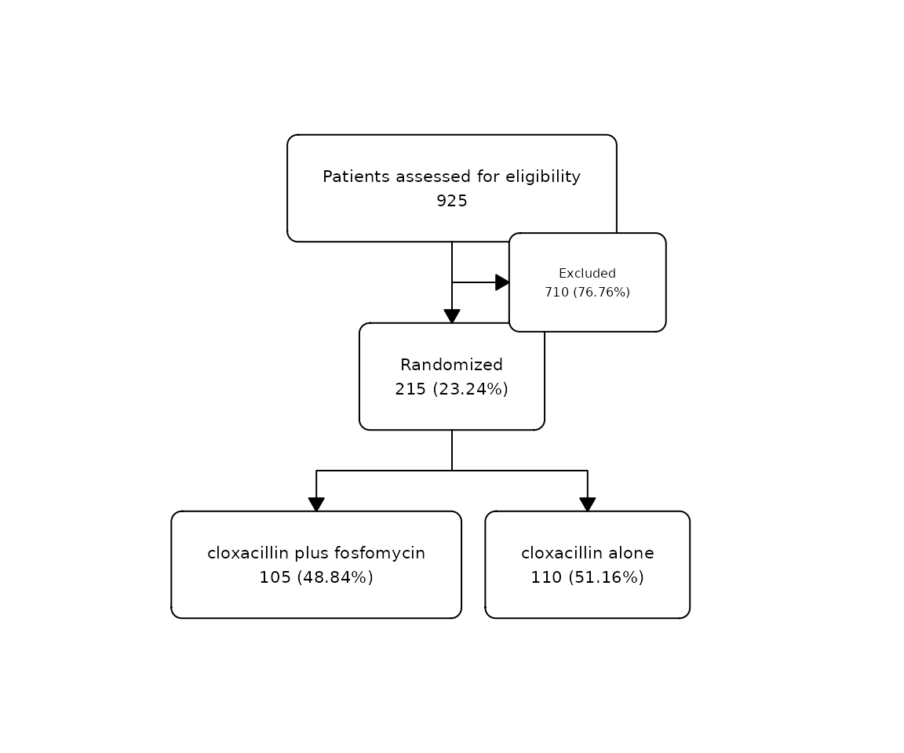

We can also add/remove space to the distance between the excluded box in
a filter using the argument `offset_exc`:

``` r

safo |> 
  as_fc(label = "Patients assessed for eligibility") |>
  fc_filter(!is.na(group), label = "Randomized", show_exc = TRUE, offset_exc = 0.1) |> 
  fc_split(group) |> 
  fc_draw()
```

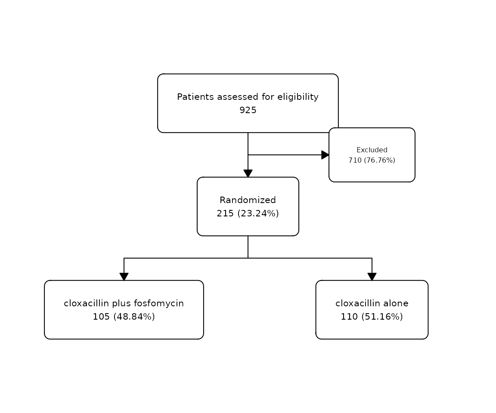

### Change Box Corner Style

We can change the corner style of the flowchart boxes using the
`box_corners` argument with `fc_draw`:

``` r

safo |> 
  as_fc(label = "Patients assessed for eligibility") |>
  fc_filter(!is.na(group), label = "Randomized", show_exc = TRUE) |> 
  fc_split(group) |> 
  fc_draw(box_corners = "sharp")
```


### Use expressions

We can use expressions in the label or the text pattern of each box.
Expressions allow you to use bold or italic text without having to
change the font of all the box text.

For example, let’s put and expression in the label:

``` r

safo |> 
  as_fc(label = expression(paste("Patients ", italic("assessed"), " for ", bold("eligibility")))) |>
  fc_draw()
```

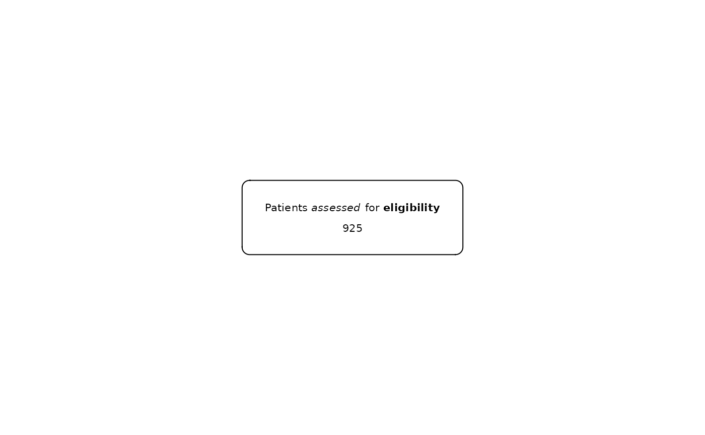

Now, let’s use it also in the text pattern of the box:

``` r

safo |>
  as_fc(label = expression(paste("Patients ", italic("assessed"), " for ", bold("eligibility"))), text_pattern = expression(paste("{label}", bold("{n}")))) |>
  fc_filter(filter = chronic_heart_failure == "No",
            label = expression(paste(italic("No chronic"), bold(" heart failure"))),
            label_exc = expression(paste(bold("Chronic"), " heart failure")),
            text_pattern = expression(paste("{label}", N, " = ", bold("{n}"), "/{N}: ", italic("{perc}"), "%")),
            text_pattern_exc = expression(paste("{label}", bold("{n}"), "({perc})%")),
            show_exc = TRUE) |>
  fc_draw()
```

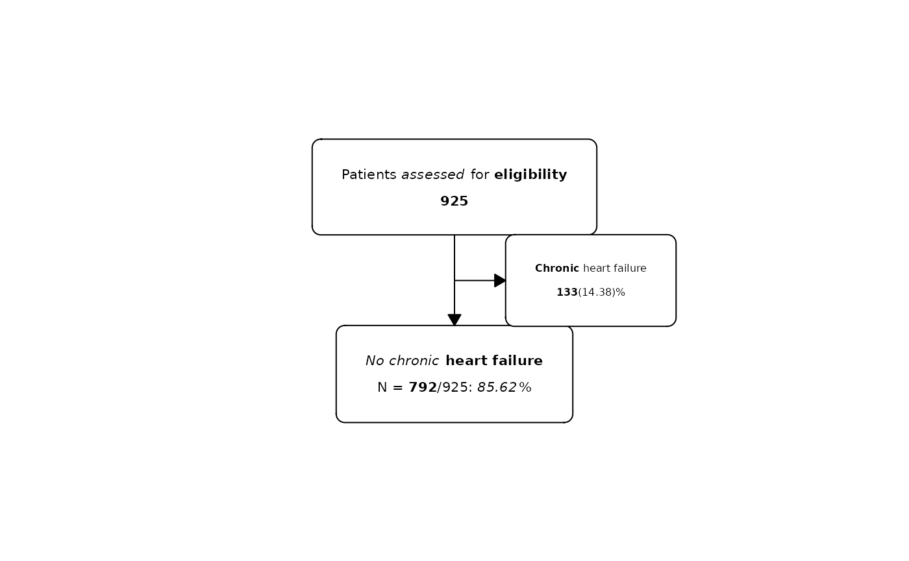

Expressions even allow the use of formulas. For example:

``` r

as_fc(N = 500, label = expression(paste(y, " = ", alpha, " + ", beta, x)), text_pattern = expression(paste("{label}", bold("{n}")))) |>
  fc_draw()
```

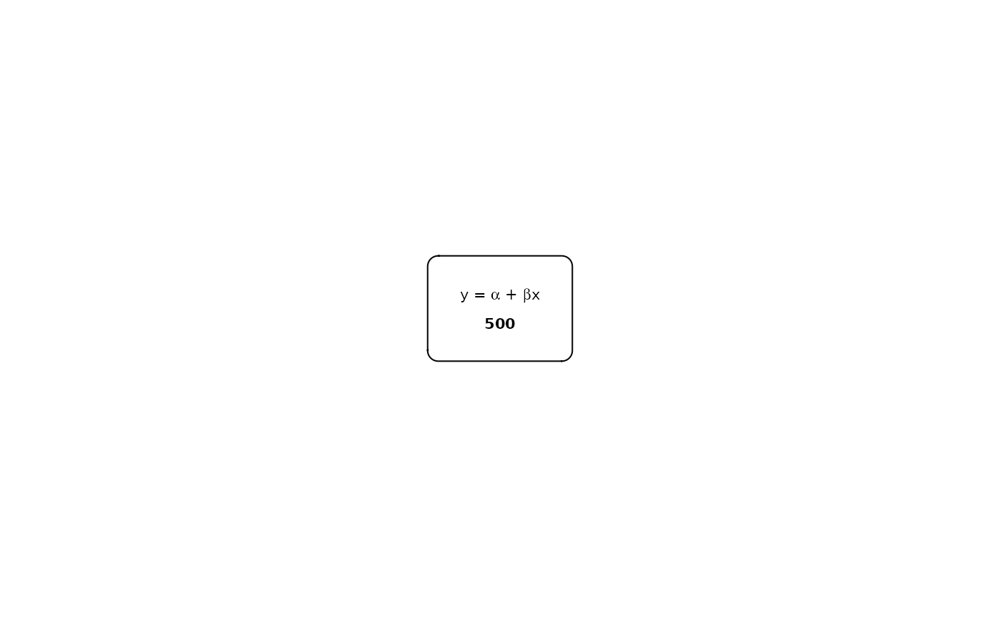

### Split in one group

We can perform an additional split only in one of the groups using the
argument `sel_group=`:

``` r

safo |> 
  as_fc(label = "Patients assessed for eligibility") |>
  fc_filter(!is.na(group), label = "Randomized", show_exc = TRUE) |> 
  fc_split(group) |> 
  fc_split(N = c(50, 60), sel_group = "cloxacillin alone") |> 
  fc_draw()
```

    ## Warning: `object$data` has been grouped by a new variable called `split1_sel_group`,
    ## because `sel_group` has been used in the split.

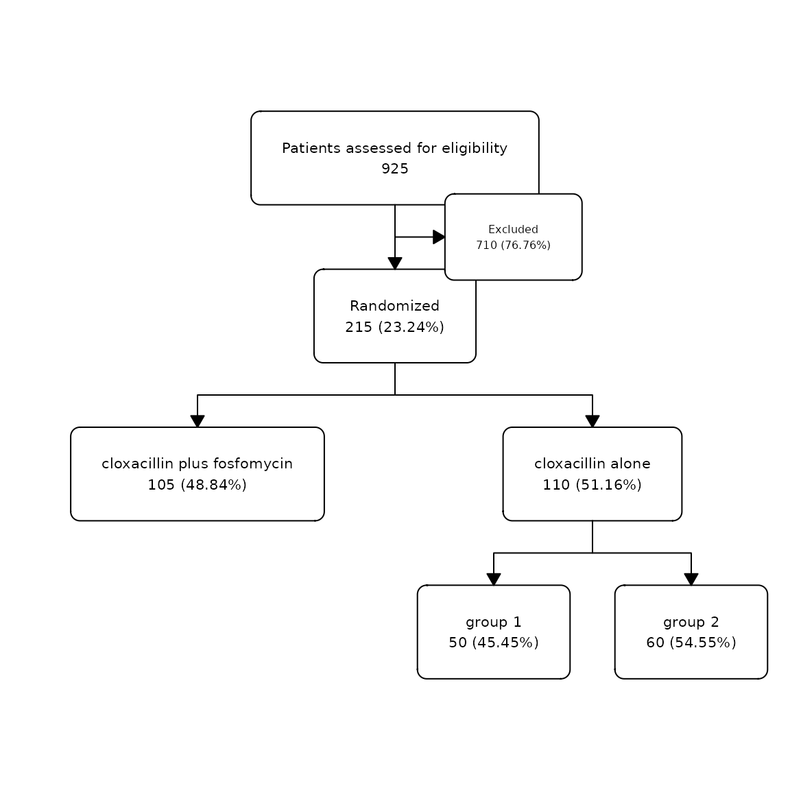

Then, we could also perform a filter in the other group:

``` r

safo |> 
  as_fc(label = "Patients assessed for eligibility") |>
  fc_filter(!is.na(group), label = "Randomized", show_exc = TRUE) |> 
  fc_split(group) |> 
  fc_split(N = c(50, 60), sel_group = "cloxacillin alone") |> 
  fc_filter(N = 50, sel_group = "cloxacillin plus fosfomycin") |> 
  fc_draw()
```

    ## Warning: `object$data` has been grouped by a new variable called `split1_sel_group`,
    ## because `sel_group` has been used in the split.

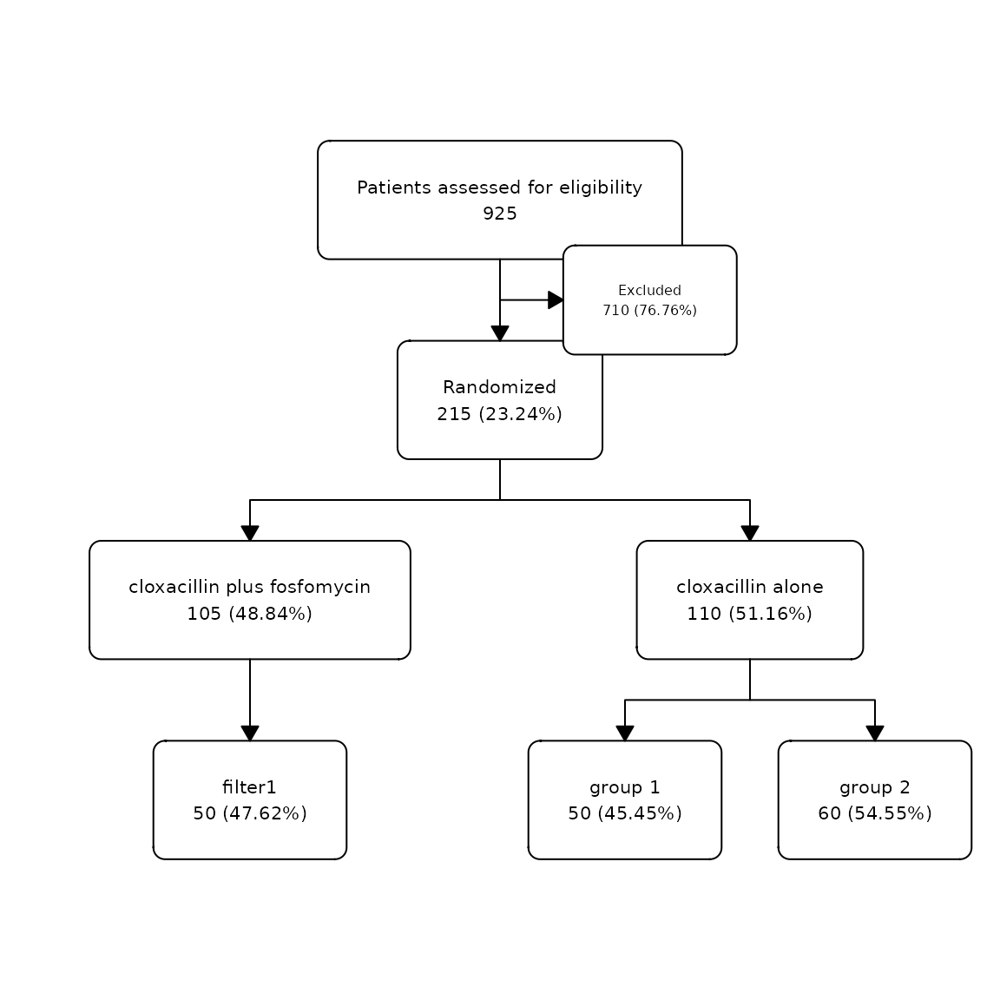

If we want to select a group in a flowchart with more than two groups we
have to supply a vector in `sel_group=` with the desired groups to be
selected:

``` r

safo |> 
  as_fc(label = "Patients assessed for eligibility") |>
  fc_filter(!is.na(group), label = "Randomized", show_exc = TRUE) |> 
  fc_split(group) |> 
  fc_split(N = c(50, 55, 10, 100)) |> 
  fc_filter(N = 60, sel_group = c("cloxacillin alone", "group 2")) |> 
  fc_draw()
```

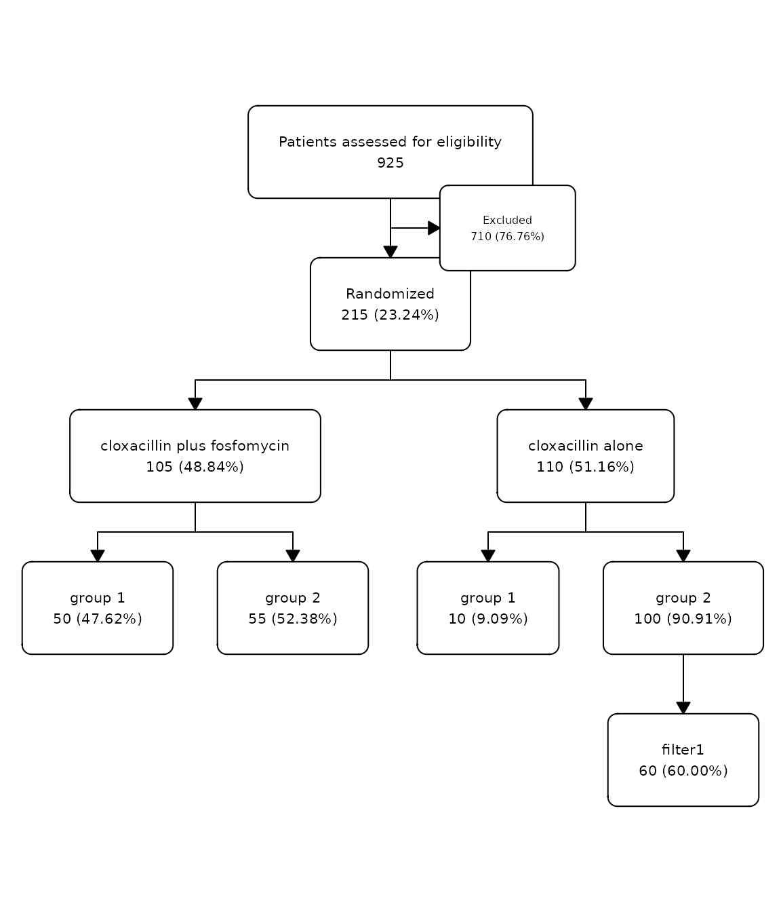

Previous to modifying it, we can use the function
[`fc_view()`](https://bruigtp.github.io/flowchart/reference/fc_view.md)
to inspect the element `$fc` that we want to change:

``` r

safo_fc |> 
  fc_view("fc")
```

    ## # A tibble: 3 × 22
    ##      id     x     y     n     N perc  label text_pattern text  type  group just 
    ##   <int> <dbl> <dbl> <int> <int> <chr> <chr> <chr>        <chr> <chr> <lgl> <chr>
    ## 1     1  0.5  0.667   925   925 100   Pati… "{label}\n{… "Pat… init  NA    cent…
    ## 2     2  0.5  0.333   215   925 23.24 Rand… "{label}\n … "Ran… filt… NA    cent…
    ## 3     3  0.65 0.5     710   925 76.76 Excl… "{label}\n … "Exc… excl… NA    cent…
    ## # ℹ 10 more variables: text_color <chr>, text_fs <dbl>, text_fface <dbl>,
    ## #   text_ffamily <lgl>, text_padding <dbl>, bg_fill <chr>, border_color <chr>,
    ## #   width <lgl>, height <lgl>, end <lgl>

Let’s customise the text in the exclusion box (`id = 3`) to specify
different reasons for exclusion, and change the *x* and *y* coordinate:

``` r

safo_fc |> 
  fc_modify(
    ~ . |> 
      mutate(
        text = ifelse(id == 3, str_glue("- {sum(safo$inclusion_crit == 'Yes')} not met the inclusion criteria\n- {sum(safo$exclusion_crit == 'Yes')} met the exclusion criteria"), text),
        x = case_when(
          id == 3 ~ 0.75,
          TRUE ~ x
        ),
        y = case_when(
          id == 1 ~ 0.8,
          id == 2 ~ 0.2,
          TRUE ~ y
        )
      )
  ) |> 
  fc_draw()
```

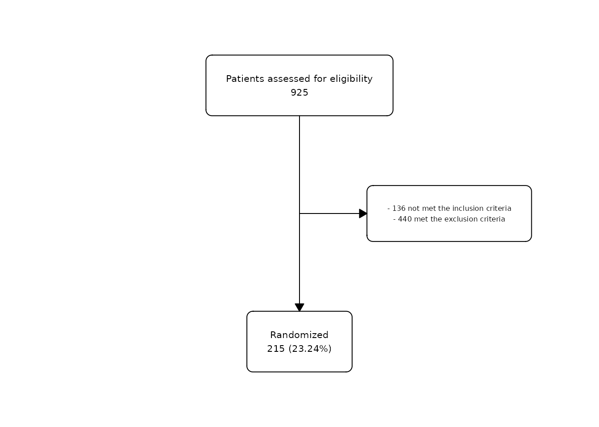
