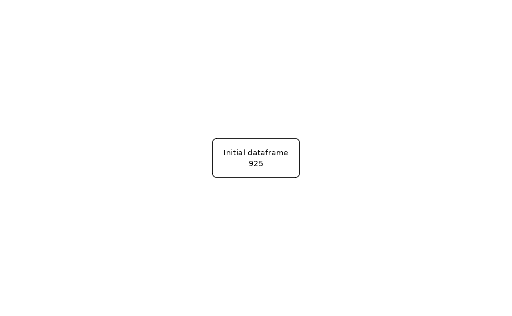
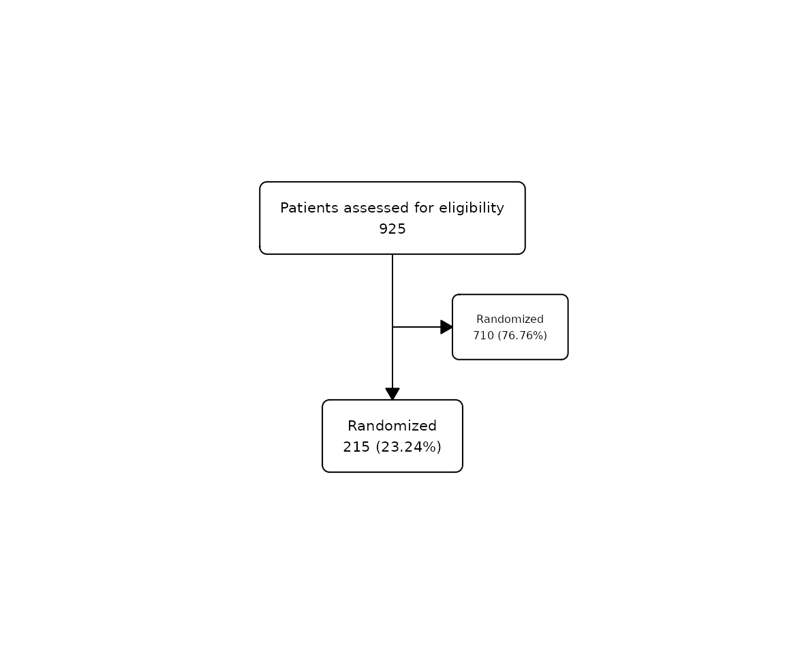
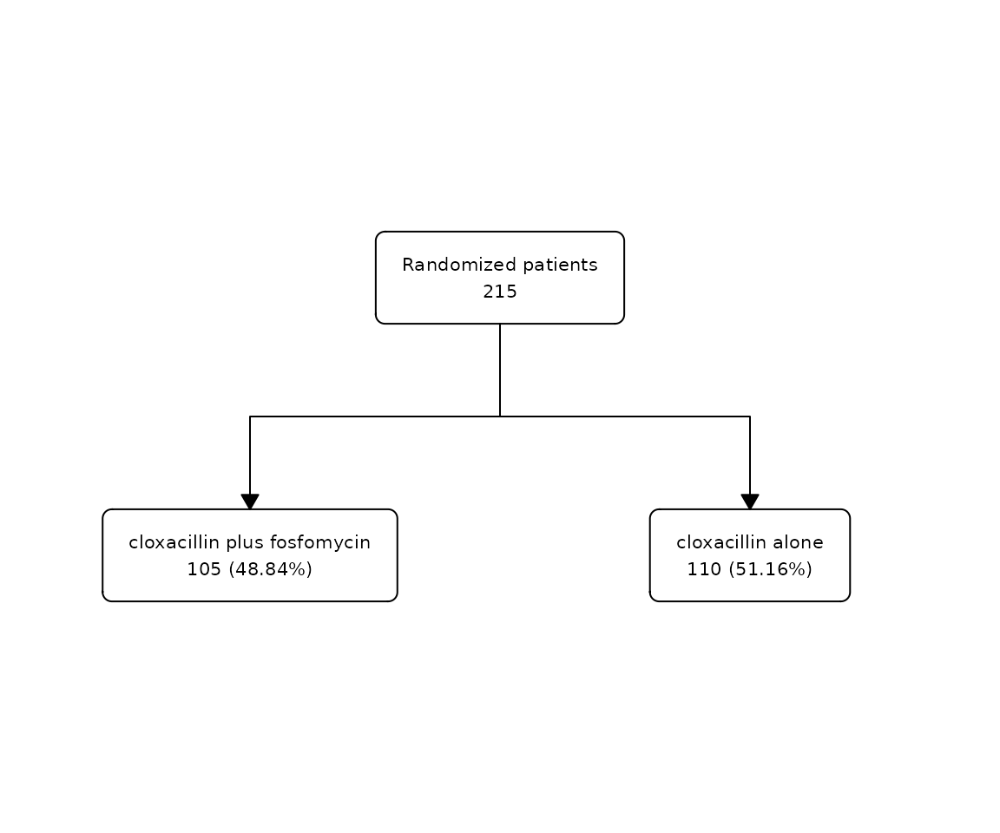

# flowchart

## Overview

`flowchart` is a package for drawing participant flow diagrams directly
from a `data.frame` using tidyverse. It provides a set of functions that
can be combined with `|>` to create all kinds of flowcharts from a
`data.frame` in an easy way:

- [`as_fc()`](https://bruigtp.github.io/flowchart/dev/reference/as_fc.md)
  transforms a `data.frame` into a `fc` object that can be manipulated
  by the package

- [`fc_split()`](https://bruigtp.github.io/flowchart/dev/reference/fc_split.md)
  splits a flowchart according to the different values of a column in
  the `data.frame`

- [`fc_filter()`](https://bruigtp.github.io/flowchart/dev/reference/fc_filter.md)
  creates a filtered box from the flowchart, based on the evaluation of
  an expression in the `data.frame`

- [`fc_merge()`](https://bruigtp.github.io/flowchart/dev/reference/fc_merge.md)
  combines horizontally two different flowcharts

- [`fc_stack()`](https://bruigtp.github.io/flowchart/dev/reference/fc_stack.md)
  combines vertically two different flowcharts

- [`fc_modify()`](https://bruigtp.github.io/flowchart/dev/reference/fc_modify.md)
  allows to modify the parameters of the flowchart which are stored in
  `.$fc`

- [`fc_draw()`](https://bruigtp.github.io/flowchart/dev/reference/fc_draw.md)
  draws the flowchart created by the previous functions

- [`fc_export()`](https://bruigtp.github.io/flowchart/dev/reference/fc_export.md)
  allows to export the flowchart drawn to the desired format

## Installation

We can install the stable version in CRAN:

``` r
install.packages("flowchart")
```

Or the development version from GitHub:

``` r
# install.packages("remotes")
remotes::install_github('bruigtp/flowchart')
```

## `safo` dataset

We will use the built-in dataset `safo`, which is a randomly generated
dataset from the SAFO trial[¹](#fn1). SAFO is an open-label,
multicentre, phase III–IV superiority randomised clinical trial designed
to assess whether cloxacillin plus fosfomycin administered during the
first 7 days of therapy achieves better treatment outcomes than
cloxacillin alone in hospitalised patients with meticillin-sensitive
Staphylococcus aureus bacteraemia.

``` r
library(flowchart)

data(safo)

head(safo) 
```

    ## # A tibble: 6 × 21
    ##      id inclusion_crit exclusion_crit chronic_heart_failure expected_death_24h
    ##   <int> <fct>          <fct>          <fct>                 <fct>             
    ## 1     1 Yes            No             No                    No                
    ## 2     2 No             No             No                    No                
    ## 3     3 No             No             No                    No                
    ## 4     4 No             Yes            No                    No                
    ## 5     5 No             No             No                    No                
    ## 6     6 No             Yes            No                    No                
    ## # ℹ 16 more variables: polymicrobial_bacteremia <fct>,
    ## #   conditions_affect_adhrence <fct>, susp_prosthetic_valve_endocard <fct>,
    ## #   severe_liver_cirrhosis <fct>, acute_sars_cov2 <fct>,
    ## #   blactam_fosfomycin_hypersens <fct>, other_clinical_trial <fct>,
    ## #   pregnancy_or_breastfeeding <fct>, previous_participation <fct>,
    ## #   myasthenia_gravis <fct>, decline_part <fct>, group <fct>, itt <fct>,
    ## #   reason_itt <fct>, pp <fct>, reason_pp <fct>

## Basic operations

The first step is to initialise the flowchart with `as_fc`. The last
step, if we want to visualise the created flowchart, is to draw the
flowchart with `fc_draw`. In between we can combine the functions
`fc_split`., `fc_filter`, `fc_merge`, `fc_stack` with the operator pipe
(`|>` or `%>$`) to create complex flowchart structures.

### Initialize

To initialize a flowchart from a dataset we have to use the
[`as_fc()`](https://bruigtp.github.io/flowchart/dev/reference/as_fc.md)
function:

``` r
safo_fc <- safo |> 
  as_fc()

str(safo_fc, max.level = 1)
```

    ## List of 2
    ##  $ data: tibble [925 × 21] (S3: tbl_df/tbl/data.frame)
    ##  $ fc  : tibble [1 × 22] (S3: tbl_df/tbl/data.frame)
    ##  - attr(*, "class")= chr "fc"

The `safo_fc` object created is a `fc` object, which consists of a list
containing the tibble of the `data.frame` associated with the flowchart
and the tibble that stores the flowchart parameters. In this example,
`safo_fc$data` corresponds to the `safo` dataset while `safo_fc$fc`
contains the parameters of the initial flowchart:

``` r
safo_fc$fc
```

    ## # A tibble: 1 × 22
    ##      id     x     y     n     N perc  label text_pattern text  type  group just 
    ##   <dbl> <dbl> <dbl> <int> <int> <chr> <chr> <chr>        <chr> <chr> <lgl> <chr>
    ## 1     1   0.5   0.5   925   925 100   Init… "{label}\n{… "Ini… init  NA    cent…
    ## # ℹ 10 more variables: text_color <chr>, text_fs <dbl>, text_fface <dbl>,
    ## #   text_ffamily <lgl>, text_padding <dbl>, bg_fill <chr>, border_color <chr>,
    ## #   width <lgl>, height <lgl>, end <lgl>

Alternatively, if a `data.frame` is not available, we can initialize a
flowchart using the `N =` argument manually specifying the number of
rows:

### Draw

The function
[`fc_draw()`](https://bruigtp.github.io/flowchart/dev/reference/fc_draw.md)
allows to draw the flowchart associated to any `fc` object. Following
the last example, we can draw the initial flowchart that has been
previously created:

``` r
safo_fc |> 
  fc_draw()
```



### Filter

We can filter the flowchart using
[`fc_filter()`](https://bruigtp.github.io/flowchart/dev/reference/fc_filter.md)
specifying the logic in which the filter is to be applied. For example,
we can show the number of patients that were randomized in the study:

``` r
safo |> 
  as_fc(label = "Patients assessed for eligibility") |> 
  fc_filter(!is.na(group), label = "Randomized", show_exc = TRUE) |> 
  fc_draw()
```


Percentages are calculated from the box in the previous level. See
‘Modify function arguments’ for more information on the `label=` and
`show_exc=` arguments.

Alternatively, if the column to filter is not available, we can use the
`N =` argument to manually specify the number of rows of the resulting
filter:

``` r
safo |> 
  as_fc(label = "Patients assessed for eligibility") |> 
  fc_filter(N = 215, label = "Randomized", show_exc = TRUE) |> 
  fc_draw()
```



### Split

We can split the flowchart into groups using
[`fc_split()`](https://bruigtp.github.io/flowchart/dev/reference/fc_split.md)
specifying the grouping variable. The function will split the flowchart
into as many categories as the specified variable has. For example, we
can split the previous flowchart showing the patients allocated in the
two study treatments:

``` r
safo |>
  dplyr::filter(!is.na(group)) |>
  as_fc(label = "Randomized patients") |>
  fc_split(group) |>
  fc_draw()
```


Percentages are calculated from the box in the previous level.

Alternatively, if the column to split is not available, we can use the
`N =` argument to manually specify the number of rows in each group of
the resulting split:

``` r
safo |>
  dplyr::filter(!is.na(group)) |>
  as_fc(label = "Randomized patients") |>
  fc_split(N = c(105, 110), label = c("cloxacillin plus fosfomycin", "cloxacillin alone")) |> 
  fc_draw()
```



The idea is to combine the
[`fc_filter()`](https://bruigtp.github.io/flowchart/dev/reference/fc_filter.md)
and
[`fc_split()`](https://bruigtp.github.io/flowchart/dev/reference/fc_split.md)
functions in the way we want to create different flowchart structures,
however complex the may be.

### Export

Once the flowchart has been drawn we can export it to the most popular
image formats, including both bitmap (png, jpeg, tiff, bmp) and vector
(svg, pdf) formats, using
[`fc_export()`](https://bruigtp.github.io/flowchart/dev/reference/fc_export.md):

``` r
safo |> 
  as_fc(label = "Patients assessed for eligibility") |>
  fc_filter(!is.na(group), label = "Randomized", show_exc = TRUE) |> 
  fc_draw() |> 
  fc_export("flowchart.png")
```

We can change the size and resolution of the stored image.

``` r
safo |> 
  as_fc(label = "Patients assessed for eligibility") |>
  fc_filter(!is.na(group), label = "Randomized", show_exc = TRUE) |> 
  fc_draw() |> 
  fc_export("flowchart.png", width = 3000, height = 4000, res = 700)
```

------------------------------------------------------------------------

1.  Grillo, S., Pujol, M., Miró, J.M. et al. Cloxacillin plus fosfomycin
    versus cloxacillin alone for methicillin-susceptible Staphylococcus
    aureus bacteremia: a randomized trial. Nat Med 29, 2518–2525 (2023).
    <https://doi.org/10.1038/s41591-023-02569-0>
